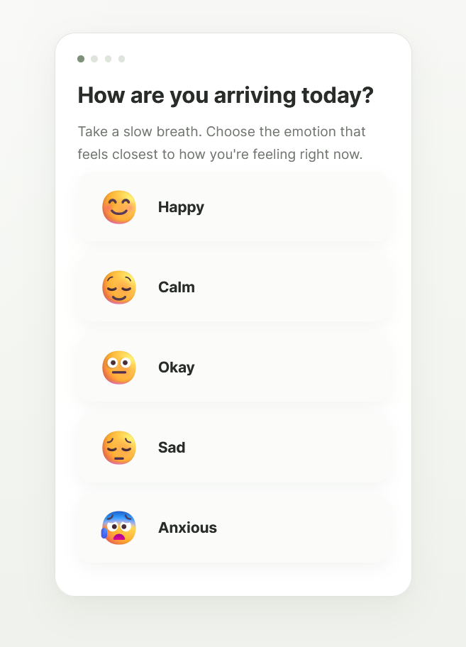
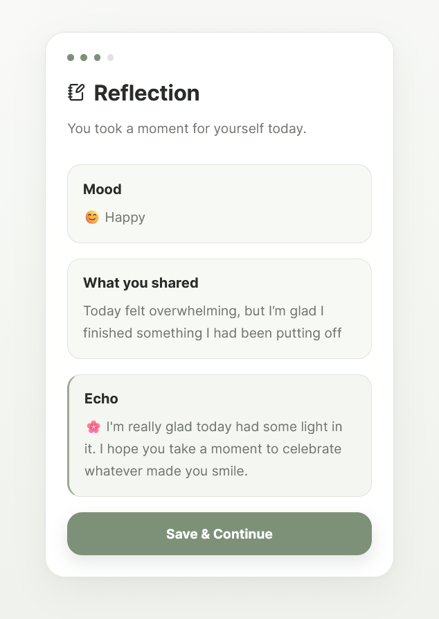
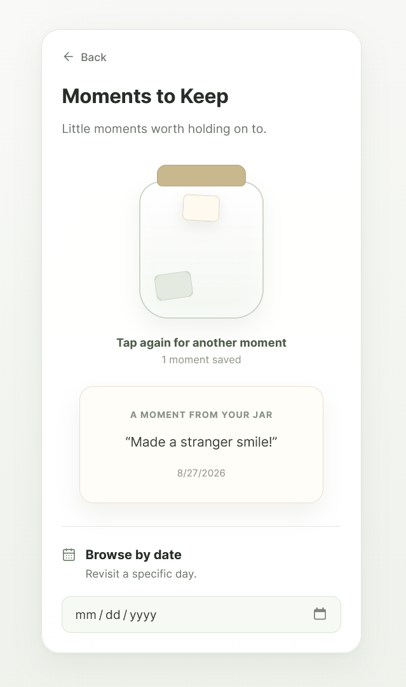
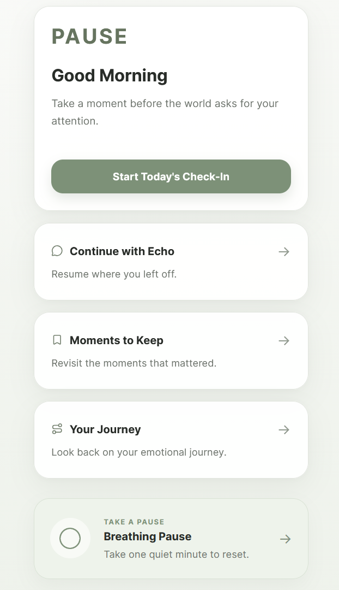

# PAUSE V2

> A mindful space to check in, reflect, and remember.

PAUSE is a reflective wellness web app designed to help users slow down, understand how they're feeling, continue past reflections, and revisit meaningful moments over time.

**[View Live Demo](https://pause-v2.vercel.app)**

---

## The Idea

Many wellness apps emphasize streaks, metrics, and consistency.

I wanted to explore a different question:

**What if a wellness app focused less on performance and more on helping someone feel heard, remembered, and welcomed back?**

PAUSE was designed around that idea.

---

## Product Experience

### 1. Check in with yourself

Users begin by choosing the emotion that feels closest to how they're feeling.

### 2. Reflect with Echo

Users can write about what's on their mind. Echo responds based on the selected mood and creates a gentle reflection experience.

### 3. Keep meaningful moments

Instead of presenting saved memories as another list, PAUSE uses an interactive **Memory Jar**.

Users can tap the jar to rediscover a randomly selected moment or browse memories from a specific date.

---

## Home Experience

The home screen gives returning users several ways to interact with PAUSE without requiring them to complete another check-in.

Users can:

- Start a new check-in
- Continue a previous conversation with Echo
- Rediscover saved moments
- Look back through their emotional journey
- Take a one-minute breathing pause

---

## Key Features

- **Mood Check-In** — select how you're feeling in the moment
- **Echo** — receive a mood-aware reflective response
- **Continue with Echo** — return to your previous reflection
- **Moments to Keep** — save meaningful moments for later
- **Interactive Memory Jar** — randomly rediscover saved memories
- **Browse by Date** — revisit moments from a specific day
- **Your Journey** — review previous emotional check-ins
- **Breathing Pause** — a simple guided inhale/exhale experience
- **Local Persistence** — reflections and memories remain available between sessions

---

## Product & UX Decisions

### No streak pressure

PAUSE intentionally avoids streaks.

Missing a day shouldn't make someone feel as though they've failed at taking care of themselves. Users can simply return whenever they need the space.

### Memory over metrics

Instead of focusing only on charts or scores, PAUSE preserves what users actually wrote and allows them to revisit those experiences.

### The Memory Jar

Saved moments originally appeared as a traditional list.

I redesigned the experience around an interactive jar so revisiting a memory feels like rediscovering something rather than browsing another database of entries.

### Breathing as an optional experience

Breathing Pause sits outside the required check-in flow. Users can choose it when they want a quiet reset without having to journal or record a mood.

### Calm, neutral visual system

The interface uses a muted sage palette, restrained typography, outline icons, whitespace, and soft cards to create a calm experience without making the design feel overly clinical.

---

## Tech Stack

- React
- JavaScript
- Vite
- CSS
- LocalStorage
- Lucide React
- Git & GitHub
- Vercel

---

## How It Works

PAUSE is currently a frontend MVP.

React manages the interface and screen states, while browser `localStorage` stores reflections, journey entries, and saved moments.

This allowed me to prototype the complete product experience without requiring authentication or a backend.

---

## What I Learned

Building PAUSE involved more than implementing individual screens. I iterated on the product flow as the application evolved.

Some of the key challenges included:

- Designing continuity between separate user sessions
- Preventing duplicate journey entries
- Handling old and new local storage data structures
- Turning the Memory Jar from a decorative element into an interaction
- Maintaining a consistent design system across features
- Building responsive, reusable React components
- Debugging case-sensitive module imports during production deployment

---

## Future Improvements

- AI-powered contextual Echo responses
- Authentication and cloud synchronization
- Cross-device persistence
- Mood trends and reflection insights
- Accessibility improvements
- User testing and usability research
- Analytics instrumentation to understand feature engagement

---

## Status

**PAUSE V2 is a working MVP deployed on Vercel.**

The project explores the intersection of product thinking, UX design, emotional wellness, and frontend development.